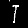

# PROCESAMIENTO Y CLASIFICACIÓN DE IMÁGENES CON EMNIST

## Autores
- [Carlos A. Cancino Escobar](https://github.com/C4ncino)
- [Juan Pablo Gómez Haro Cabrera](https://github.com/JuanPabloGHC)

## Introducción

En este trabajo se describe la creación y entrenamiento de un modelo de red neuronal buscando y comparando la mejor arquitectura para esta, todos los modelos tiene la siguiente arquitectura base: 
  - Una capa de entrada con 784 neuronas para que cada una pues recibir un pixel de la imagen de 28x28, 
  - Una combinación de capas ocultas 
  - La capa de salida de 47 neuronas para ubicar la clase a la que pertenece que varían entre números y letras. 

Al finalizar del entrenamiento, se analizaron los resultados comparando entre las dos propuestas y las métricas de precisión para utilizar el modelo mejor entrenado. 

Posteriormente se buscará obtener imágenes de autos donde se visualicen placas de autos y al ejecutar el algoritmo se identifique cada carácter de esta para mandarlo al modelo y predecir a que clase pertenece.

## Objetivo general

Entrenar un modelo que pueda identificar números y letras, sin importar la rotación, para poder identificar los valores de placas de autos a través de imágenes.

## Objetivos específicos

- Leer los datasets de entrenamientos y de pruebas para guardarlos dentro de nuestro programa.
- Encontrar la mejor solución de la arquitectura de la red neuronal para entrenar el modelo.
- Leer las imágenes de los vehículos.
- Obtener los caracteres de las placas.
- Probar el modelo con los caracteres obtenidos.

## Tecnologías

- Python
- Librerías:
  - Tensorflow
  - Opencv
  - Pandas
  - Numpy
  - Matplotlib.pyplot

Todas las librerías se pueden descargar mediante el archivo `requirements.txt`

## Dataset

El dataset que se utiliza es el de EMNIST dividido en 2 archivos .csv. El primero para entrenamiento y el segundo para pruebas, donde se encuentran las diferentes clases con la matriz de valores de 0 a 255 en escala de grises representando la escritura de las letras y números. Para su uso con los scripts se deben encontrar en la carpeta `data` bajo los nombres de `train.csv` y `test.csv`

## Modelos

Cada integrante entrenó un modelo diferente en busca de la mejor arquitectura. A continuación se muestran los resultados de cada uno de los modelos con el numero de épocas de entrenamiento y sus respectivas arquitecturas y sus resultados con el dataset de prueba. 

Así mismo se muestran las gráficas con los datos de la perdida de cada época de entrenamiento la linea azul representa la perdida de la red durante el entrenamiento y la linea naranja la perdida de la red durante el pruebas.

### Historial de versiones Cancino

En este caso se realizaron las pruebas de 5 modelos diferentes, los cuales se muestran a continuación.

#### v1

**Epochs**: `15`

**Arquitectura**

| Tipo  | Unidades | Activación | Dropout |
| :---: | :------: | :--------: | :-----: |
| Dense |   400    |    ReLu    |   0.3   |
| Dense |   250    |    ReLu    |   0.2   |
| Dense |   200    |    ReLu    |   0.2   |
| Dense |   100    |    ReLu    |   0.1   |
| Dense |   100    |    ReLu    |   N/A   |

**Resultados de la red**

| Etapa | Pérdida | Precisión |
| :---: | :-----: | :-------: |
| Train | 0.4210  |  85.11%   |
| Test  | 0.4380  |  85.31%   |


**Gráfica de desempeño**


---

#### v2

**Epochs**: `8`

**Arquitectura del Modelo**

| Capa  | Unidades | Función de Activación | Dropout |
| :---: | :------: | :-------------------: | :-----: |
| Dense |   800    |         ReLU          |   0.2   |
| Dense |   800    |         ReLU          |   0.2   |
| Dense |   250    |         ReLU          |  0.15   |

**Resultados de la Red Neuronal**

| Etapa | Pérdida | Precisión |
| :---: | :-----: | :-------: |
| Train | 0.3625  |  86.62%   |
| Test  | 0.4385  |  85.54%   |

**Gráfico de Desempeño**


---

#### v3

**Epochs**: `5`

**Arquitectura del Modelo**

| Capa  | Unidades | Función de Activación | Dropout |
| :---: | :------: | :-------------------: | :-----: |
| Dense |   1000   |         ReLU          |   N/A   |
| Dense |   256    |         ReLU          |   0.3   |
| Dense |   128    |         ReLU          |   0.1   |

**Resultados de la Red Neuronal**

| Etapa | Pérdida | Precisión |
| :---: | :-----: | :-------: |
| Train | 0.4092  |  85.53%   |
| Test  | 0.4442  |  85.21%   |

**Gráfico de Desempeño**


---

#### v4

**Epochs**: `1`


**Arquitectura del Modelo**

| Capa  | Unidades | Función de Activación | Dropout |
| :---: | :------: | :-------------------: | :-----: |
| Dense |   190    |         ReLU          |   0.2   |
| Dense |   190    |         ReLU          |   0.2   |

**Resultados de la Red Neuronal**

| Etapa | Pérdida | Precisión |
| :---: | :-----: | :-------: |
| Train | 0.4565  |  84.00%   |
| Test  | 0.4426  |  85.02%   |

**Gráfico de Desempeño**


---

#### v5

**Epochs**: `1`


**Arquitectura del Modelo**

| Capa  | Unidades | Función de Activación | Dropout |
| :---: | :------: | :-------------------: | :-----: |
| Dense |   180    |         ReLU          |  0.15   |
| Dense |   180    |         ReLU          |  0.15   |

**Resultados de la Red Neuronal**

| Etapa | Pérdida | Precisión |
| :---: | :-----: | :-------: |
| Train | 0.4237  |  84.93%   |
| Test  | 0.4466  |  85.21%   |

**Gráfico de Desempeño**


#### v5.1

**Resultados de la Red Neuronal**

| Etapa | Pérdida | Precisión |
| :---: | :-----: | :-------: |
| Train | 0.4124  |  85.24%   |
| Test  | 0.4454  |  85.24%   |

**Gráfico de Desempeño**


### Historial de versiones Juan Pablo

#### v1

**Epochs**: `10`

**Arquitectura del Modelo**

| Capa  | Unidades | Función de Activación | Dropout |
| :---: | :------: | :-------------------: | :-----: |
| Dense |   512    |         ReLU          |   0.2   |
| Dense |   256    |         ReLU          |   0.2   |
| Dense |   128    |         ReLU          |   0.1   |
| Dense |   256    |         ReLU          |   0.1   |
| Dense |    64    |         ReLU          |   N/A   |

**Resultados de la Red Neuronal**

| Etapa |  Pérdida  | Precisión |
| :---: | :-------: | :-------: |
| Train | Sin datos | Sin datos |
| Test  |  0.4883   |  84.45%   |

**Gráfico de Desempeño**


---

#### v2

**Epochs**: `10`

**Arquitectura del Modelo**

| Capa  | Unidades | Función de Activación | Dropout |
| :---: | :------: | :-------------------: | :-----: |
| Dense |   512    |         ReLU          |   0.2   |
| Dense |   256    |         ReLU          |   0.2   |
| Dense |   512    |         ReLU          |   0.2   |
| Dense |    64    |         ReLU          |   0.1   |
| Dense |    32    |         ReLU          |   N/A   |

**Resultados de la Red Neuronal**

| Etapa |  Pérdida  | Precisión |
| :---: | :-------: | :-------: |
| Train | Sin datos | Sin datos |
| Test  |  0.4984   |  83.53%   |

**Gráfico de Desempeño**


---

#### v3

**Epochs**: `10`

**Arquitectura del Modelo**

| Capa  | Unidades | Función de Activación | Dropout |
| :---: | :------: | :-------------------: | :-----: |
| Dense |   512    |         ReLU          |   0.2   |
| Dense |   256    |         ReLU          |  0.25   |
| Dense |   512    |         ReLU          |  0.25   |
| Dense |   128    |         ReLU          |   0.1   |
| Dense |    32    |         ReLU          |   N/A   |

**Resultados de la Red Neuronal**

| Etapa |  Pérdida  | Precisión |
| :---: | :-------: | :-------: |
| Train | Sin datos | Sin datos |
| Test  |  0.4896   |  83.93%   |

**Gráfico de Desempeño**


## Pruebas

Se probaron dos formas distintas.

1. Se tomó cada carácter en color blanco y el resto en color negro.
2. A esa primera forma se le hizo una rotación aleatoria entre 25 a 270 grados.

### Modelo Cancino v5.1


### Modelo Juan Pablo v1


## Procesamiento de imagen

### Objetivo

Obtener los caracteres de una placa en una imagen de un vehículo en un formato de 28x28 en blanco y negro, siendo el carácter en blanco y el fondo en negro, para poder mandarlo como una prueba al modelo.

### Procedimiento

- Se leen las imágenes con la librería de opencv y con ayuda de la librería de matplotlib se visualizan en una gráfica.
- Se tomaron las coordenadas manualmente de cada imagen, almacenando la información en un json.
- Se crean recortes de cada carácter con las coordenadas previamente almacenadas.
- De cada recorte se obtiene el valor máximo de su forma, en caso de ser una imagen rectangular, siendo el ancho o lo alto más alto, para crear un `canva` cuadrado de esa dimensión.
- Se llena de blanco el `canva` y posteriormente se pega el recorte en el centro.
- Se recorre cada píxel de este nuevo `canva` y dependiendo el valor de pixel se le asigna un 0 o un 255 para quitar todo aquel color o tono que pueda distorsionar la imagen y al mismo tiempo invertir el blanco y negro.
- Se reajusta el tamaño de la imagen para tenerla en forma de 28x28.
- Se guarda la imagen con el nuevo tamaño y se hace una rotación aleatoria entre 25 a 270 grados y se guarda en la carpeta correspondiente.

### Ejemplos

**Imagen original**


**Caracteres**




#### Json

```json
    {
        "path": "<directory/image.png>",
        "name": "<name>",
        "caracteres": [
            {
                "x": [
                    <x0>,
                    <x1>
                ],
                "y": [
                    <y0>,
                    <y1>
                ]
            },
            {
                "x": [
                    <x0>,
                    <x1>
                ],
                "y": [
                    <y0>,
                    <y1>
                ]
            },
            {
                "x": [
                    <x0>,
                    <x1>
                ],
                "y": [
                    <y0>,
                    <y1>
                ]
            }
        ]
    }
```

## Instalación

- Clonar el repositorio.
- Moverte a la carpeta del proyecto.
- Instalar todas las dependencias.

```bash
    git clone https://github.com/C4ncino/Neuronal-Network-EMNIST.git
	
    cd Neuronal-Network-EMNIST
    
	pip install -r requirements.txt
```