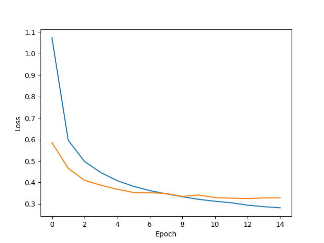
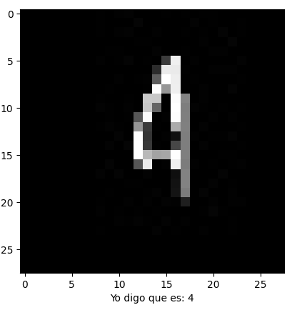
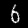

# PROCESAMIENTO Y CLASIFICACIÓN DE IMÁGENES CON EMNIST

## Autores
- [Carlos A. Cancino Escobar](https://github.com/C4ncino)
- [Juan Pablo Gómez Haro Cabrera](https://github.com/JuanPabloGHC)

## Introducción

En este trabajo se describe la creación y entrenamiento de un modelo de red neuronal buscando y comparando la mejor arquitectura para esta, todos los modelos tiene la siguiente arquitectura base: 
  - Una capa de entrada con 784 neuronas para que cada una pues recibir un pixel de la imagen de 28x28, 
  - Una combinación de capas ocultas 
  - La capa de salida de 36 neuronas para ubicar la clase a la que pertenece que varían entre números y letras. 

Al finalizar del entrenamiento, se analizaron los resultados comparando entre las dos propuestas y las métricas de precisión para utilizar el modelo mejor entrenado. 

Posteriormente se buscará obtener imágenes de autos donde se visualicen placas de autos y al ejecutar el algoritmo se identifique cada carácter de esta para mandarlo al modelo y predecir a que clase pertenece.

## Objetivo general

Entrenar un modelo que pueda identificar números y letras, sin importar la rotación, para poder identificar los valores de placas de autos a través de imágenes.

## Objetivos específicos

- Leer los datasets de entrenamientos y de pruebas para guardarlos dentro de nuestro programa.
- Encontrar la mejor solución de la arquitectura de la red neuronal para entrenar el modelo.
- Leer las imágenes de los vehículos.
- Obtener los caracteres de las placas.
- Probar el modelo con los caracteres obtenidos.

## Tecnologías

- Python
- Librerías:
  - Tensorflow
  - Opencv
  - Pandas
  - Numpy
  - Matplotlib.pyplot

Todas las librerías se pueden descargar mediante el archivo `requirements.txt`

## Dataset

El dataset que se utiliza es el de EMNIST dividido en 2 archivos .csv. El primero para entrenamiento y el segundo para pruebas, donde se encuentran las diferentes clases con la matriz de valores de 0 a 255 en escala de grises representando la escritura de las letras y números. Para su uso con los scripts se deben encontrar en la carpeta `data` bajo los nombres de `train.csv` y `test.csv`

Para el entrenamiento de los modelos se eliminaron aquellos valores que sean letras minúsculas (a, b, d, e, f, g, h, n, q, r, t) ya que al estar dirigido a reconocimiento de caracteres de Placas de coches, solo se requieren las letras mayúsculas, evitando mayor confusión en el entrenamiento.

## Mapping

```python
classes = {
    0: '0', 1: '1', 2: '2', 3: '3', 4: '4', 5: '5', 6: '6',
    7: '7', 8: '8', 9: '9', 10: 'A', 11: 'B', 12: 'C',
    13: 'D', 14: 'E', 15: 'F', 16: 'G', 17: 'H', 18: 'I',
    19: 'J', 20: 'K', 21: 'L', 22: 'M', 23: 'N', 24: 'O',
    25: 'P', 26: 'Q', 27: 'R', 28: 'S', 29: 'T', 30: 'U',
    31: 'V', 32: 'W', 33: 'X', 34: 'Y', 35: 'Z'
}
```

## Modelos

Cada integrante entrenó un modelo diferente en busca de la mejor arquitectura. A continuación se muestran los resultados de cada uno de los modelos con el numero de épocas de entrenamiento y sus respectivas arquitecturas y sus resultados con el dataset de prueba. 

Así mismo se muestran las gráficas con los datos de la perdida de cada época de entrenamiento la linea azul representa la perdida de la red durante el entrenamiento y la linea naranja la perdida de la red durante el pruebas.

### Historial de versiones Cancino

En este caso se realizaron las pruebas de 5 modelos diferentes, los cuales se muestran a continuación.

#### v1

**Epochs**: `15`

**Arquitectura**

| Tipo  | Unidades | Activación | Dropout |
| :---: | :------: | :--------: | :-----: |
| Dense |   400    |    ReLu    |   0.3   |
| Dense |   250    |    ReLu    |   0.2   |
| Dense |   200    |    ReLu    |   0.2   |
| Dense |   100    |    ReLu    |   0.1   |
| Dense |   100    |    ReLu    |   N/A   |

**Resultados de la red**

| Etapa | Pérdida | Precisión |
| :---: | :-----: | :-------: |
| Train | 0.3448  |  87.68%   |
| Test  | 0.3321  |  88.73%   |


**Gráfica de desempeño**


---

#### v2

**Epochs**: `8`

**Arquitectura del Modelo**

| Capa  | Unidades | Función de Activación | Dropout |
| :---: | :------: | :-------------------: | :-----: |
| Dense |   800    |         ReLU          |   0.2   |
| Dense |   800    |         ReLU          |   0.2   |
| Dense |   250    |         ReLU          |  0.15   |

**Resultados de la Red Neuronal**

| Etapa | Pérdida | Precisión |
| :---: | :-----: | :-------: |
| Train | 0.2645  |  89.86%   |
| Test  | 0.3249  |  89.28%   |

**Gráfico de Desempeño**


---

#### v3

**Epochs**: `5`

**Arquitectura del Modelo**

| Capa  | Unidades | Función de Activación | Dropout |
| :---: | :------: | :-------------------: | :-----: |
| Dense |   1000   |         ReLU          |   N/A   |
| Dense |   256    |         ReLU          |   0.3   |
| Dense |   128    |         ReLU          |   0.1   |

**Resultados de la Red Neuronal**

| Etapa | Pérdida | Precisión |
| :---: | :-----: | :-------: |
| Train | 0.2985  |  88.94%   |
| Test  | 0.3496  |  87.74%   |

**Gráfico de Desempeño**


---

#### v4

**Epochs**: `15`


**Arquitectura del Modelo**

| Capa  | Unidades | Función de Activación | Dropout |
| :---: | :------: | :-------------------: | :-----: |
| Dense |   190    |         ReLU          |   0.2   |
| Dense |   190    |         ReLU          |   0.2   |

**Resultados de la Red Neuronal**

| Etapa | Pérdida | Precisión |
| :---: | :-----: | :-------: |
| Train | 0.2825  |  89.33%   |
| Test  | 0.3283  |  88.83%   |

**Gráfico de Desempeño**



---

#### v5

**Epochs**: `15`


**Arquitectura del Modelo**

| Capa  | Unidades | Función de Activación | Dropout |
| :---: | :------: | :-------------------: | :-----: |
| Dense |   180    |         ReLU          |  0.15   |
| Dense |   180    |         ReLU          |  0.15   |

**Resultados de la Red Neuronal**

| Etapa | Pérdida | Precisión |
| :---: | :-----: | :-------: |
| Train | 0.2922  |  88.86%   |
| Test  | 0.3352  |  88.65%   |

**Gráfico de Desempeño**


**Gráfico de Desempeño**


### Historial de versiones Juan Pablo

#### v1

**Epochs**: `10`

**Arquitectura del Modelo**

| Capa  | Unidades | Función de Activación | Dropout |
| :---: | :------: | :-------------------: | :-----: |
| Dense |   512    |         ReLU          |   0.2   |
| Dense |   256    |         ReLU          |   0.2   |
| Dense |   128    |         ReLU          |   0.1   |
| Dense |   256    |         ReLU          |   0.1   |
| Dense |    64    |         ReLU          |   N/A   |

**Resultados de la Red Neuronal**

| Etapa | Pérdida | Precisión |
| :---: | :-----: | :-------: |
| Train | 0.3145  |  88.59%   |
| Test  | 0.3337  |  88.26%   |

**Gráfico de Desempeño**


---

#### v2

**Epochs**: `10`

**Arquitectura del Modelo**

| Capa  | Unidades | Función de Activación | Dropout |
| :---: | :------: | :-------------------: | :-----: |
| Dense |   512    |         ReLU          |   0.2   |
| Dense |   256    |         ReLU          |   0.2   |
| Dense |   512    |         ReLU          |   0.2   |
| Dense |    64    |         ReLU          |   0.1   |
| Dense |    32    |         ReLU          |   N/A   |

**Resultados de la Red Neuronal**

| Etapa | Pérdida | Precisión |
| :---: | :-----: | :-------: |
| Train | 0.3232  |  88.42%   |
| Test  | 0.3275  |  88.90%   |

**Gráfico de Desempeño**


---

#### v3

**Epochs**: `10`

**Arquitectura del Modelo**

| Capa  | Unidades | Función de Activación | Dropout |
| :---: | :------: | :-------------------: | :-----: |
| Dense |   512    |         ReLU          |   0.2   |
| Dense |   256    |         ReLU          |  0.25   |
| Dense |   512    |         ReLU          |  0.25   |
| Dense |   128    |         ReLU          |   0.1   |
| Dense |    32    |         ReLU          |   N/A   |

**Resultados de la Red Neuronal**

| Etapa | Pérdida | Precisión |
| :---: | :-----: | :-------: |
| Train | 0.3268  |  88.26%   |
| Test  | 0.3404  |  88.61%   |

**Gráfico de Desempeño**


## Pruebas

Se probaron dos formas distintas.

1. Se tomó cada carácter en color blanco y el resto en color negro.
2. A esa primera forma se le hizo una rotación aleatoria entre 25 a 270 grados.

### Modelo Cancino v5.1


Modelo juanpablo v1





## Procesamiento de imagen

### Objetivo

Obtener los caracteres de una placa en una imagen de un vehículo en un formato de 28x28 en blanco y negro, siendo el carácter en blanco y el fondo en negro, para poder mandarlo como una prueba al modelo.

### Procedimiento

- Se leen las imágenes con la librería de opencv y con ayuda de la librería de matplotlib se visualizan en una gráfica.
- Se tomaron las coordenadas manualmente de cada imagen, almacenando la información en un json.
- Se crean recortes de cada carácter con las coordenadas previamente almacenadas.
- De cada recorte se obtiene el valor máximo de su forma, en caso de ser una imagen rectangular, siendo el ancho o lo alto más alto, para crear un `canva` cuadrado de esa dimensión.
- Se llena de blanco el `canva` y posteriormente se pega el recorte en el centro.
- Se recorre cada píxel de este nuevo `canva` y dependiendo el valor de pixel se le asigna un 0 o un 255 para quitar todo aquel color o tono que pueda distorsionar la imagen y al mismo tiempo invertir el blanco y negro.
- Se reajusta el tamaño de la imagen para tenerla en forma de 28x28.
- Se guarda la imagen con el nuevo tamaño y se hace una rotación aleatoria entre 25 a 270 grados y se guarda en la carpeta correspondiente.

### Ejemplos

**Imagen original**


**Caracteres**




### Json

```json
    {
        "path": "<directory/image.png>",
        "name": "<name>",
        "caracteres": [
            {
                "x": [
                    <x0>,
                    <x1>
                ],
                "y": [
                    <y0>,
                    <y1>
                ]
            },
            {
                "x": [
                    <x0>,
                    <x1>
                ],
                "y": [
                    <y0>,
                    <y1>
                ]
            },
            {
                "x": [
                    <x0>,
                    <x1>
                ],
                "y": [
                    <y0>,
                    <y1>
                ]
            }
        ]
    }
```

## Conclusiones

En cuanto al dataset el entrenamiento se ve afectado por la cantidad de clases que se generan, provocando mayor confusion al tomar en cuenta clases que no se utilizan, siendo ejemplo las letras minúsculas, ademas el hecho de que están rotadas, volteadas, etc, provoca que los patrones cambien y sea complicado la identificación de los caracteres puestos correctamente.

Por otro lado, las arquitecturas podemos decir que las que se probaron con un mayor numero de neuronas en sus capas llegaron a un sobre-entrenamiento más rápido que las demás, no obstante uno de estos fue el que aparentemente mejor resultados obtuvo. Los demás modelos que se construyeron tardaron más en entrenar y tuvieron una mejor relación entre su perdida de entrenamiento y la de validación.

Por último, la manera en que se le otorgan las imágenes de las placas es de suma importancia, ya que de esto depende que el modelo sea capaz de identificarlas. Por ejemplo importa que tan grande se vea el carácter o la posible rotación que tenga.  


## Estructura

```plane
├──📁/documentation          
│   ├──📁/cancino         
│   │   ├──🖼️[imágenes de gráficas]
│   │   └──🖼️[imágenes de pruebas]
│   ├──📁/juanpablo       
│   │   ├──🖼️[imágenes de gráficas]
│   │   └──🖼️[imágenes de pruebas]
│
├──📁/images                 
│   ├──📁/[carpeta de cada coche]
│   │   └──🖼️[imágenes de los caracteres]
│   └──🖼️[fotos de coches]
│
├──📁/models                 
│   ├──📁/cancino          
│   │   └──📄[versiones de modelos de IA entrenados]
│   └──📁/juanpablo        
│       └──📄[versiones de modelos de IA entrenados]
│
├──🐍class_mapping.py
├──📝coches.json
├──🐍E2_train_test_Cancino.py
├──🐍E2.1_cars_Cancino.py
├──🐍E2.2_generate images_Cancino.py
├──🐍models.py
└──📝requirements.txt
```

- /documentation: 
    - Imágenes para documentar el proceso y resultados del entrenamientoy  las pruebas de cada integrante.
- /images: 
    - Imágenes originales de los coches y las imágenes de los caracteres obtenidos.
- /models: 
    - Modelos guardados por versiones previamente entrenados.
- class_mapping.py:
    - Diccionario de las clases resultantes del dataset.
- coches.json:
    - Json con la información de las imágenes y sus coordenadas para obtener los caracteres.
- E2_train_test_Cancino.py:
    - Código para entrenar y probar los dataset con el modelo indicado.
- E2.1_cars_Cancino.py:
    - Código para hacer pruebas de cualquier modelo para una imagen específica, visualizando las predicciones.
- E2.2_generate images_Cancino.py:
    - Código para tomar cada imagen de coches y obtener los caracteres, de acuerdo con el json, haciendo el proceso adecuado a la imagen para que esté en el formato adecuado para las pruebas y almacenandolas en carpetas separadas.
- requirements.txt:
    - Las dependencias que se utilizarón en el proyecto.

## Instalación

- Clonar el repositorio.
- Moverte a la carpeta del proyecto.
- Instalar todas las dependencias.

```bash
git clone https://github.com/C4ncino/Neuronal-Network-EMNIST.git

cd Neuronal-Network-EMNIST

pip install -r requirements.txt
```