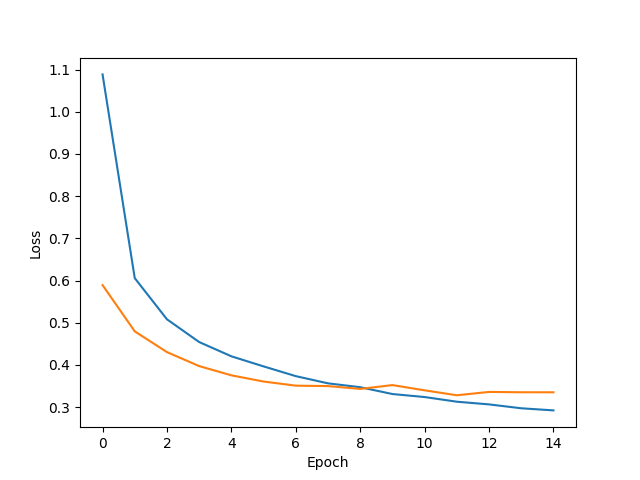
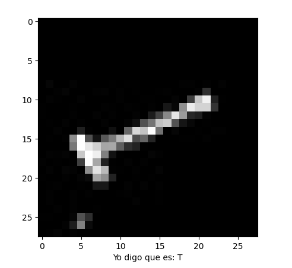
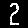

# PROCESAMIENTO Y CLASIFICACIÓN DE IMÁGENES CON EMNIST

## Autores
- Carlos Andrés Cancino Escobar
- Juan Pablo Gómez Haro Cabrera

## Introducción
En este trabajo se crea y se entrena un modelo de red neuronal buscando y comparando la mejor arquitectura para esta, su capa de entrada con 47 neuronas (números del 0-9 y todas las letras del abecedario), la capa oculta a elegir para obtener el mejor resultado y la capa de salida de 47 neuronas para ubicar la clase a la que pertenece. Al finalizar del entrenamiento, se analizan los resultados comparando entre las dos propuestas y las métricas de precisión para utilizar el modelo mejor entrenado. Posteriormente se buscará obtener imágenes de autos donde se visualicen placas de autos y al ejecutar el algoritmo se identifique la placa y cada caractér de esta para mandarlo al modelo y predecir a que clase pertenece.

## Objetivo general
Entrenar un modelo que pueda identificar números y letras, sin importar la rotación, para poder identificar los valores de placas de autos a través de imágenes.

## Objetivos específicos
- Leer los datasets de entrenamientos y de pruebas para guardarlos dentro de nuestro programa.
- Entcontrar la mejor solución de la arquitectura de la red neuronal para entrenar el modelo.
- Leer las imágenes de los vehículos.
- Obtener los caracteres de las placas.
- Probar el modelo con los caracteres obtenidos.

## Tecnologías
- Python
- Red neuronal
    - Para el desarrollo del modelo de red neuronal y su entrenamiento se utilizarán las siguientes librerías:
        - Tensorflow
        - Opencv
        - Pandas
        - Numpy
        - Matplotlib.pyplot

## Dataset
El dataset que se utiliza es el de EMNIST dividido en 2 archivos .csv. El primero para entrenamiento y el segundo para pruebas, en donde vienen las diferentes clases con la matriz de valores de 0 a 255 en escala de grises representando la escritura de las letras y números.

## Modelos

## Historial de versiones cancino

### v1

Epochs: 15

| Type  | Units | Activation | Dropout |
| ----- | ----- | ---------- | ------- |
| Dense | 400   | relu       | 0.3     |
| Dense | 250   | relu       | 0.2     |
| Dense | 200   | relu       | 0.2     |
| Dense | 100   | relu       | 0.1     |
| Dense | 100   | relu       | N/A     |

last epoch

loss: 0.4210 - accuracy: 0.8511 - val_loss: 
0.4380 - val_accuracy: 0.8531

Accuracy: [0.4380095899105072, 0.8531383275985718]


### v2

Epochs: 8

| Type  | Units | Activation | Dropout |
| ----- | ----- | ---------- | ------- |
| Dense | 800   | relu       | 0.2     |
| Dense | 800   | relu       | 0.2     |
| Dense | 250   | relu       | 0.15    |

last epoch 

loss: 0.3625 - accuracy: 0.8662 - val_loss: 0.4385 - val_accuracy: 0.8554

Accuracy: [0.4385177493095398, 0.8554255366325378]


### v3

Epochs: 5

| Type  | Units | Activation | Dropout |
| ----- | ----- | ---------- | ------- |
| Dense | 1000  | relu       | N/A     |
| Dense | 256   | relu       | 0.3     |
| Dense | 128   | relu       | 0.1     |

last epoch

loss: 0.4092 - accuracy: 0.8553 - val_loss: 0.4442 - val_accuracy: 0.8521

Accuracy: [0.444208562374115, 0.8521276712417603]


### v4

Epochs: 15

| Type  | Units | Activation | Dropout |
| ----- | ----- | ---------- | ------- |
| Dense | 190   | relu       | 0.2     |
| Dense | 190   | relu       | 0.2     |

last epoch 
loss: 0.4565 - accuracy: 0.8400 - val_loss: 0.4426 - val_accuracy: 0.8502

Accuracy: [0.4425795376300812, 0.8501595854759216]


### v5

Epochs: 15

| Type  | Units | Activation | Dropout |
| ----- | ----- | ---------- | ------- |
| Dense | 180   | relu       | 0.15    |
| Dense | 180   | relu       | 0.15    |

last epoch
loss: 0.4237 - accuracy: 0.8493 - val_loss: 
0.4466 - val_accuracy: 0.8521

Accuracy: [0.4466071128845215, 0.8521276712417603]



#### v5.1

loss: 0.4124 - accuracy: 0.8524 - val_loss: 
0.4454 - val_accuracy: 0.8524

Accuracy: [0.4454222023487091, 0.852393627166748]


## Historial de versiones juan pablo

### v1

Epochs: 10

| Type  | Units | Activation | Dropout |
| ----- | ----- | ---------- | ------- |
| Dense | 512   | relu       | 0.2     |
| Dense | 256   | relu       | 0.2     |
| Dense | 128   | relu       | 0.1     |
| Dense | 256   | relu       | 0.1     |
| Dense | 64    | relu       | N/A     |

Accuracy: [0.4883, 0.8445]


### v2

Epochs: 10

| Type  | Units | Activation | Dropout |
| ----- | ----- | ---------- | ------- |
| Dense | 512   | relu       | 0.2     |
| Dense | 256   | relu       | 0.2     |
| Dense | 512   | relu       | 0.2     |
| Dense | 64    | relu       | 0.1     |
| Dense | 32    | relu       | N/A     |

Accuracy: [0.4984, 0.8353]


### v3

Epochs: 10

| Type  | Units | Activation | Dropout |
| ----- | ----- | ---------- | ------- |
| Dense | 512   | relu       | 0.2     |
| Dense | 256   | relu       | 0.25    |
| Dense | 512   | relu       | 0.25    |
| Dense | 128   | relu       | 0.1     |
| Dense | 32    | relu       | N/A     |

Accuracy: [0.4896, 0.8393]


## Pruebas

Se probaron dos formas distintas.
1.  Se tomó cada caracter en color blanco y el resto en color negro.
2. A esa primera forma se le hizo una rotación aleatoria entre 25 a 270 grados.

Modelo cancino v5.1




Modelo juanpablo v1


## Procesamiento de imagen
### Objetivo
Obtener los caracteres de una placa en una imagen de un vehículo en un formato de 28x28 en blanco y negro, siendo el carácter en blanco y el fondo en negro, para poder mandarlo como una prueba al modelo.

### Procedimiento
- Se leen las imágenes con la librería de opencvy con ayuda de la librería de matplotlib se visualizan en una gráfica.
- Se tomaron las coordenadas manualmente de cada imagen, almacenando la información en un json.
- Se crean subimágenes de cada carácter con las coordenadas previamente almaceandas.
- A cada subimagen se obtiene el valor máximo de su forma, en caso de ser una imagen rectangular, siendo el ancho o lo alto más alto, para crear un canva cuadrado de esa dimensión.
- Se llena de blanco el canva y posteriormente se pega la subimagen en el centro.
- Se recorre cada píxel de este nuevo canva y dependiendo el valor de pixel se le asigna un 0 o un 255 para quitar todo aquel color o tono que pueda distorsionar la imagen y al mismo tiempo invertir el blanco y negro.
- Se reajusta el tamaño de la imagen para tenerla en forma de 28x28.
- Se guardan todas las nuevas imágenes de los caracteres en sus carpetas correspondientes.

### Ejemplos

Imagen original


Caracteres





#### Json

```json
    {
        "path": "<directory/image.png>",
        "name": "<name>",
        "caracteres": [
            {
                "x": [
                    <x0>,
                    <x1>
                ],
                "y": [
                    <y0>,
                    <y1>
                ]
            },
            {
                "x": [
                    <x0>,
                    <x1>
                ],
                "y": [
                    <y0>,
                    <y1>
                ]
            },
            {
                "x": [
                    <x0>,
                    <x1>
                ],
                "y": [
                    <y0>,
                    <y1>
                ]
            },
            {
                "x": [
                    <x0>,
                    <x1>
                ],
                "y": [
                    <y0>,
                    <y1>
                ]
            },
            {
                "x": [
                    <x0>,
                    <x1>
                ],
                "y": [
                    <y0>,
                    <y1>
                ]
            },
            {
                "x": [
                    <x0>,
                    <x1>
                ],
                "y": [
                    <y0>,
                    <y1>
                ]
            }
        ]
    }
```

# Instalación

- Clonar el repositorio.
- Moverte a la carpeta del proyecto.
- Instalar todas las dependencias.

```bash
    git clone https://github.com/C4ncino/Neuronal-Network-EMNIST.git
	
    cd Neuronal-Network-EMNIST
    
	pip install -r requirements.txt
```